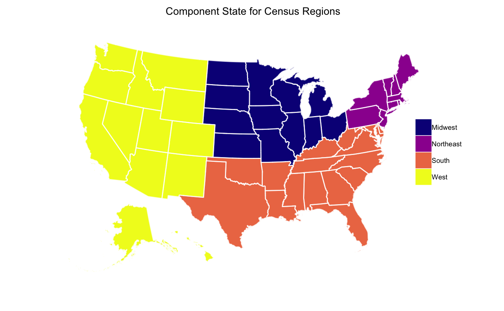
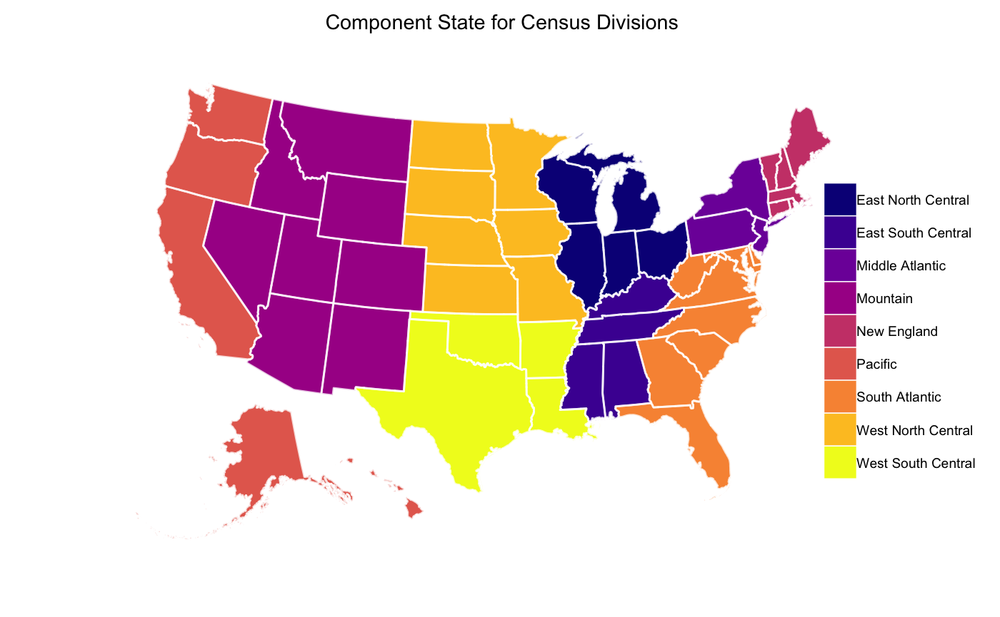

<!-- README.md is generated from README.Rmd. Please edit that file -->

[](https://travis-ci.org/jjchern/fips)
[](https://ci.appveyor.com/project/jjchern/fips)

# About {fips}

The R package {fips} makes it easier to merge geographic identifiers
such as state FIPS, county FIPS, urban-rural codes, BEA region codes,
and census region and division codes.

For an overview of regions of the United States, see the wiki page for
[List of regions of the United
States](https://en.wikipedia.org/wiki/List_of_regions_of_the_United_States).

The following datasets are available:

  - `fips::fips`, `fips::state`, and `fips::lower48`:
      - State-level FIPS codes.
        [(Source)](https://www.census.gov/geo/reference/ansi_statetables.html)
      - `fips::fips` contains 50 states, the District of Columbia, and
        the Outlying Areas of the United States.
      - `fips::state` contains 50 states and the District of Columbia.
      - `fips::lower48` contains the 48 Contiguous Continental States
        and the District of Columbia.
  - `fips::county`, `fips::county_ipums_usa`
      - County-level FIPS codes.
      - `fips::county` contains 2010 county-level FIPS codes.
        [(Source)](https://www.census.gov/geo/reference/codes/cou.html)
      - `fips::county_ipums_usa` contains counties that are identified
        through the microdata maintained by IPUMS.
        [(Source)](https://usa.ipums.org/usa-action/variables/COUNTYFIP#description_section)
  - `fips::nchs_urc`:
      - NCHS Urban-Rural Classification Scheme for Counties.
        [(Source)](https://www.cdc.gov/nchs/data_access/urban_rural.htm)
  - `fips::bea_region`:
      - BEA Region codes.
        [(Source)](https://www.bea.gov/regional/docs/regions.cfm)
  - `fips::census_region_division`:
      - Census Bureau region and division codes.
        [(Source)](https://www2.census.gov/programs-surveys/popest/geographies/2015/state-geocodes-v2015.txt)

I might add other crosswalks for OMB standard federal regions, federal
reserve districts, courts of appeals circuits, and Agricultural Research
Service regions.

Similar implementation in Stata:

  - [{statastates} by
    `@wschpero`](https://github.com/wschpero/statastates)

Similar R packages:

  - [{zipcodes} by `@jacobkap`](https://github.com/jacobkap/zipcodes)
  - [The dataset `US_states` in {EconData} by
    `@floswald`](https://github.com/floswald/EconData)

# Installation

You can install the development version of {fips} from Github with:

``` r
# install.packages("remotes")
remotes::install_github("jjchern/fips")
```

Or install the most recent released version of {fips} from Github with:

``` r
remotes::install_github("jjchern/fips@v0.0.5")
```

# Usage

## State-level FIPS code

``` r
library(tidyverse)
fips::state
#> # A tibble: 51 x 3
#>    fips  usps  state               
#>    <chr> <chr> <chr>               
#>  1 01    AL    Alabama             
#>  2 02    AK    Alaska              
#>  3 04    AZ    Arizona             
#>  4 05    AR    Arkansas            
#>  5 06    CA    California          
#>  6 08    CO    Colorado            
#>  7 09    CT    Connecticut         
#>  8 10    DE    Delaware            
#>  9 11    DC    District of Columbia
#> 10 12    FL    Florida             
#> # … with 41 more rows

# fips::fips includes FIPS code for other outlying areas
fips::fips 
#> # A tibble: 57 x 3
#>    fips  usps  state               
#>    <chr> <chr> <chr>               
#>  1 01    AL    Alabama             
#>  2 02    AK    Alaska              
#>  3 04    AZ    Arizona             
#>  4 05    AR    Arkansas            
#>  5 06    CA    California          
#>  6 08    CO    Colorado            
#>  7 09    CT    Connecticut         
#>  8 10    DE    Delaware            
#>  9 11    DC    District of Columbia
#> 10 12    FL    Florida             
#> # … with 47 more rows
fips::fips %>% tail(10)
#> # A tibble: 10 x 3
#>    fips  usps  state                      
#>    <chr> <chr> <chr>                      
#>  1 53    WA    Washington                 
#>  2 54    WV    West Virginia              
#>  3 55    WI    Wisconsin                  
#>  4 56    WY    Wyoming                    
#>  5 60    AS    American Samoa             
#>  6 66    GU    Guam                       
#>  7 69    MP    Northern Mariana Islands   
#>  8 72    PR    Puerto Rico                
#>  9 74    UM    U.S. Minor Outlying Islands
#> 10 78    VI    U.S. Virgin Islands

# fips::lower48 includes the 48 continental states and DC
fips::lower48
#> # A tibble: 49 x 3
#>    fips  usps  state               
#>    <chr> <chr> <chr>               
#>  1 01    AL    Alabama             
#>  2 04    AZ    Arizona             
#>  3 05    AR    Arkansas            
#>  4 06    CA    California          
#>  5 08    CO    Colorado            
#>  6 09    CT    Connecticut         
#>  7 10    DE    Delaware            
#>  8 11    DC    District of Columbia
#>  9 12    FL    Florida             
#> 10 13    GA    Georgia             
#> # … with 39 more rows
```

## 2010 FIPS code for counties

``` r
fips::county
#> # A tibble: 3,235 x 4
#>    usps  state   fips  county         
#>    <chr> <chr>   <chr> <chr>          
#>  1 AL    Alabama 01001 Autauga County 
#>  2 AL    Alabama 01003 Baldwin County 
#>  3 AL    Alabama 01005 Barbour County 
#>  4 AL    Alabama 01007 Bibb County    
#>  5 AL    Alabama 01009 Blount County  
#>  6 AL    Alabama 01011 Bullock County 
#>  7 AL    Alabama 01013 Butler County  
#>  8 AL    Alabama 01015 Calhoun County 
#>  9 AL    Alabama 01017 Chambers County
#> 10 AL    Alabama 01019 Cherokee County
#> # ... with 3,225 more rows
```

## Counties Identified in IPUMS USA (2005-forward)

``` r
fips::county_ipums_usa %>% 
    select(state, countyfip, county_name,
           `2000 5% & 1% unwt, acs 2005`,
           `acs 2006-2011`, 
           `2010 10%, acs 2012-onward`) %>% 
    na.omit() %>% 
    select(state, countyfip, county_name) %>% 
    knitr::kable()
```

| state                | countyfip | county\_name         |
| :------------------- | :-------- | :------------------- |
| Alabama              | 01003     | Baldwin              |
| Alabama              | 01015     | Calhoun/Benton       |
| Alabama              | 01055     | Etowah               |
| Alabama              | 01073     | Jefferson            |
| Alabama              | 01081     | Lee                  |
| Alabama              | 01097     | Mobile               |
| Alabama              | 01117     | Shelby               |
| Alaska               | 02020     | Anchorage            |
| Arizona              | 04005     | Coconino             |
| Arizona              | 04013     | Maricopa             |
| Arizona              | 04019     | Pima                 |
| Arizona              | 04025     | Yavapai              |
| Arizona              | 04027     | Yuma                 |
| Arkansas             | 05007     | Benton               |
| Arkansas             | 05119     | Pulaski              |
| Arkansas             | 05143     | Washington           |
| California           | 06001     | Alameda              |
| California           | 06007     | Butte                |
| California           | 06013     | Contra Costa         |
| California           | 06017     | El Dorado            |
| California           | 06019     | Fresno               |
| California           | 06023     | Humboldt             |
| California           | 06025     | Imperial             |
| California           | 06029     | Kern                 |
| California           | 06031     | Kings                |
| California           | 06037     | Los Angeles          |
| California           | 06039     | Madera               |
| California           | 06041     | Marin                |
| California           | 06047     | Merced               |
| California           | 06055     | Napa                 |
| California           | 06059     | Orange               |
| California           | 06061     | Placer               |
| California           | 06065     | Riverside            |
| California           | 06067     | Sacramento           |
| California           | 06071     | San Bernardino       |
| California           | 06073     | San Diego            |
| California           | 06075     | San Francisco        |
| California           | 06077     | San Joaquin          |
| California           | 06079     | San Luis Obispo      |
| California           | 06081     | San Mateo            |
| California           | 06083     | Santa Barbara        |
| California           | 06085     | Santa Clara          |
| California           | 06087     | Santa Cruz           |
| California           | 06089     | Shasta               |
| California           | 06095     | Solano               |
| California           | 06097     | Sonoma               |
| California           | 06099     | Stanislaus           |
| California           | 06107     | Tulare               |
| California           | 06111     | Ventura              |
| California           | 06113     | Yolo                 |
| Connecticut          | 09001     | Fairfield            |
| Connecticut          | 09003     | Hartford             |
| Connecticut          | 09005     | Litchfield           |
| Connecticut          | 09007     | Middlesex            |
| Connecticut          | 09009     | New Haven            |
| Connecticut          | 09011     | New London           |
| Connecticut          | 09013     | Tolland              |
| Connecticut          | 09015     | Windham              |
| Delaware             | 10001     | Kent                 |
| Delaware             | 10003     | New Castle           |
| Delaware             | 10005     | Sussex               |
| District of Columbia | 11001     | District of Columbia |
| Florida              | 12001     | Alachua              |
| Florida              | 12009     | Brevard/St Lucie     |
| Florida              | 12011     | Broward              |
| Florida              | 12015     | Charlotte            |
| Florida              | 12019     | Clay                 |
| Florida              | 12021     | Collier              |
| Florida              | 12033     | Escambia             |
| Florida              | 12053     | Hernando/Benton      |
| Florida              | 12057     | Hillsborough         |
| Florida              | 12071     | Lee                  |
| Florida              | 12081     | Manatee              |
| Florida              | 12083     | Marion               |
| Florida              | 12085     | Martin               |
| Florida              | 12091     | Okaloosa             |
| Florida              | 12095     | Orange/Mesquito      |
| Florida              | 12097     | Osceola              |
| Florida              | 12099     | Palm Beach           |
| Florida              | 12101     | Pasco                |
| Florida              | 12103     | Pinellas             |
| Florida              | 12105     | Polk                 |
| Florida              | 12111     | St Lucie             |
| Florida              | 12113     | Santa Rosa           |
| Florida              | 12115     | Sarasota             |
| Florida              | 12117     | Seminole             |
| Georgia              | 13021     | Bibb                 |
| Georgia              | 13051     | Chatham              |
| Georgia              | 13057     | Cherokee             |
| Georgia              | 13063     | Clayton              |
| Georgia              | 13067     | Cobb                 |
| Georgia              | 13135     | Gwinnett             |
| Georgia              | 13139     | Hall                 |
| Georgia              | 13151     | Henry                |
| Georgia              | 13245     | Richmond             |
| Hawaii               | 15001     | Hawaii               |
| Hawaii               | 15003     | Honolulu             |
| Illinois             | 17019     | Champaign            |
| Illinois             | 17031     | Cook                 |
| Illinois             | 17043     | Du Page              |
| Illinois             | 17091     | Kankakee             |
| Illinois             | 17097     | Lake                 |
| Illinois             | 17099     | LaSalle              |
| Illinois             | 17113     | McLean               |
| Illinois             | 17115     | Macon                |
| Illinois             | 17179     | Tazewell             |
| Indiana              | 18003     | Allen                |
| Indiana              | 18035     | Delaware             |
| Indiana              | 18039     | Elkhart              |
| Indiana              | 18081     | Johnson              |
| Indiana              | 18089     | Lake                 |
| Indiana              | 18091     | La Porte             |
| Indiana              | 18097     | Marion               |
| Indiana              | 18105     | Monroe               |
| Indiana              | 18127     | Porter               |
| Indiana              | 18141     | St Joseph            |
| Iowa                 | 19013     | Black Hawk           |
| Iowa                 | 19103     | Johnson              |
| Iowa                 | 19113     | Linn                 |
| Iowa                 | 19163     | Scott                |
| Kansas               | 20091     | Johnson              |
| Kansas               | 20209     | Wyandotte            |
| Kentucky             | 21067     | Fayette              |
| Kentucky             | 21111     | Jefferson            |
| Kentucky             | 21117     | Kenton               |
| Louisiana            | 22017     | Caddo                |
| Louisiana            | 22073     | Ouachita             |
| Louisiana            | 22109     | Terrebonne           |
| Maine                | 23001     | Androscoggin         |
| Maine                | 23011     | Kennebec             |
| Maryland             | 24003     | Anne Arundel         |
| Maryland             | 24005     | Baltimore            |
| Maryland             | 24013     | Carroll              |
| Maryland             | 24017     | Charles              |
| Maryland             | 24021     | Frederick            |
| Maryland             | 24025     | Harford              |
| Maryland             | 24027     | Howard               |
| Maryland             | 24031     | Montgomery           |
| Maryland             | 24033     | Prince Georges       |
| Maryland             | 24043     | Washington           |
| Maryland             | 24510     | Baltimore City       |
| Massachusetts        | 25025     | Suffolk              |
| Michigan             | 26021     | Berrien              |
| Michigan             | 26075     | Jackson              |
| Michigan             | 26081     | Kent                 |
| Michigan             | 26093     | Livingston           |
| Michigan             | 26099     | Macomb               |
| Michigan             | 26115     | Monroe               |
| Michigan             | 26121     | Muskegon             |
| Michigan             | 26125     | Oakland              |
| Michigan             | 26139     | Ottawa               |
| Michigan             | 26145     | Saginaw              |
| Michigan             | 26161     | Washtenaw            |
| Michigan             | 26163     | Wayne                |
| Minnesota            | 27003     | Anoka                |
| Minnesota            | 27037     | Dakota               |
| Minnesota            | 27053     | Hennepin             |
| Minnesota            | 27109     | Olmsted              |
| Minnesota            | 27123     | Ramsey               |
| Minnesota            | 27163     | Washington           |
| Mississippi          | 28033     | De Soto              |
| Mississippi          | 28047     | Harrison             |
| Mississippi          | 28059     | Jackson              |
| Missouri             | 29019     | Boone                |
| Missouri             | 29099     | Jefferson            |
| Missouri             | 29183     | St Charles           |
| Missouri             | 29189     | St Louis             |
| Missouri             | 29510     | St Louis City        |
| Nebraska             | 31055     | Douglas              |
| Nebraska             | 31109     | Lancaster            |
| Nevada               | 32003     | Clark                |
| Nevada               | 32031     | Washoe               |
| New Jersey           | 34003     | Bergen               |
| New Jersey           | 34005     | Burlington           |
| New Jersey           | 34007     | Camden               |
| New Jersey           | 34013     | Essex                |
| New Jersey           | 34017     | Hudson               |
| New Jersey           | 34019     | Hunterdon            |
| New Jersey           | 34021     | Mercer               |
| New Jersey           | 34023     | Middlesex            |
| New Jersey           | 34025     | Monmouth             |
| New Jersey           | 34027     | Morris               |
| New Jersey           | 34029     | Ocean                |
| New Jersey           | 34031     | Passaic              |
| New Jersey           | 34035     | Somerset             |
| New Jersey           | 34037     | Sussex               |
| New Jersey           | 34039     | Union                |
| New Jersey           | 34041     | Warren               |
| New Mexico           | 35013     | Dona Ana             |
| New York             | 36001     | Albany               |
| New York             | 36005     | Bronx                |
| New York             | 36013     | Chautauqua           |
| New York             | 36027     | Dutchess             |
| New York             | 36029     | Erie                 |
| New York             | 36047     | Kings                |
| New York             | 36059     | Nassau               |
| New York             | 36061     | New York             |
| New York             | 36063     | Niagara              |
| New York             | 36071     | Orange               |
| New York             | 36075     | Oswego               |
| New York             | 36081     | Queens               |
| New York             | 36083     | Rensselaer           |
| New York             | 36085     | Richmond             |
| New York             | 36087     | Rockland             |
| New York             | 36089     | St Lawrence          |
| New York             | 36091     | Saratoga             |
| New York             | 36093     | Schenectady          |
| New York             | 36103     | Suffolk              |
| North Carolina       | 37001     | Alamance             |
| North Carolina       | 37035     | Catawba              |
| North Carolina       | 37051     | Cumberland           |
| North Carolina       | 37057     | Davidson             |
| North Carolina       | 37067     | Forsyth              |
| North Carolina       | 37081     | Guilford             |
| North Carolina       | 37119     | Mecklenburg          |
| North Carolina       | 37147     | Pitt                 |
| North Carolina       | 37151     | Randolph             |
| North Carolina       | 37159     | Rowan                |
| North Carolina       | 37191     | Wayne                |
| North Dakota         | 38017     | Cass                 |
| Ohio                 | 39007     | Ashtabula            |
| Ohio                 | 39017     | Butler               |
| Ohio                 | 39029     | Columbiana           |
| Ohio                 | 39035     | Cuyahoga             |
| Ohio                 | 39041     | Delaware             |
| Ohio                 | 39045     | Fairfield            |
| Ohio                 | 39049     | Franklin             |
| Ohio                 | 39057     | Greene               |
| Ohio                 | 39061     | Hamilton             |
| Ohio                 | 39089     | Licking              |
| Ohio                 | 39093     | Lorain               |
| Ohio                 | 39103     | Medina               |
| Ohio                 | 39113     | Montgomery           |
| Ohio                 | 39133     | Portage              |
| Ohio                 | 39139     | Richland             |
| Ohio                 | 39153     | Summit               |
| Ohio                 | 39165     | Warren               |
| Ohio                 | 39169     | Wayne                |
| Oregon               | 41017     | Deschutes            |
| Oregon               | 41019     | Douglas              |
| Oregon               | 41029     | Jackson              |
| Oregon               | 41039     | Lane                 |
| Oregon               | 41047     | Marion               |
| Pennsylvania         | 42003     | Allegheny            |
| Pennsylvania         | 42011     | Berks                |
| Pennsylvania         | 42017     | Bucks                |
| Pennsylvania         | 42019     | Butler               |
| Pennsylvania         | 42027     | Centre               |
| Pennsylvania         | 42029     | Chester              |
| Pennsylvania         | 42043     | Dauphin              |
| Pennsylvania         | 42045     | Delaware             |
| Pennsylvania         | 42049     | Erie                 |
| Pennsylvania         | 42051     | Fayette              |
| Pennsylvania         | 42071     | Lancaster            |
| Pennsylvania         | 42075     | Lebanon              |
| Pennsylvania         | 42085     | Mercer               |
| Pennsylvania         | 42089     | Monroe               |
| Pennsylvania         | 42091     | Montgomery           |
| Pennsylvania         | 42101     | Philadelphia         |
| Pennsylvania         | 42107     | Schuylkill           |
| Pennsylvania         | 42129     | Westmoreland         |
| Pennsylvania         | 42133     | York                 |
| Rhode Island         | 44003     | Kent                 |
| Rhode Island         | 44007     | Providence           |
| Rhode Island         | 44009     | Washington           |
| South Carolina       | 45007     | Anderson             |
| South Carolina       | 45051     | Horry                |
| South Carolina       | 45083     | Spartanburg          |
| South Carolina       | 45091     | York                 |
| Tennessee            | 47009     | Blount               |
| Tennessee            | 47037     | Davidson             |
| Tennessee            | 47149     | Rutherford           |
| Tennessee            | 47157     | Shelby               |
| Tennessee            | 47179     | Washington           |
| Tennessee            | 47187     | Williamson           |
| Texas                | 48029     | Bexar                |
| Texas                | 48039     | Brazoria             |
| Texas                | 48041     | Brazos               |
| Texas                | 48061     | Cameron              |
| Texas                | 48085     | Collin               |
| Texas                | 48113     | Dallas               |
| Texas                | 48121     | Denton               |
| Texas                | 48135     | Ector                |
| Texas                | 48139     | Ellis                |
| Texas                | 48141     | El Paso              |
| Texas                | 48157     | Fort Bend            |
| Texas                | 48167     | Galveston            |
| Texas                | 48201     | Harris               |
| Texas                | 48215     | Hidalgo              |
| Texas                | 48245     | Jefferson            |
| Texas                | 48251     | Johnson              |
| Texas                | 48303     | Lubbock              |
| Texas                | 48309     | McLennan             |
| Texas                | 48329     | Midland              |
| Texas                | 48375     | Potter               |
| Texas                | 48381     | Randall              |
| Texas                | 48423     | Smith                |
| Texas                | 48441     | Taylor               |
| Texas                | 48479     | Webb                 |
| Texas                | 48485     | Wichita              |
| Texas                | 48491     | Williamson           |
| Utah                 | 49011     | Davis                |
| Utah                 | 49035     | Salt Lake            |
| Utah                 | 49049     | Utah                 |
| Utah                 | 49057     | Weber                |
| Virginia             | 51013     | Arlington/Alexandria |
| Virginia             | 51041     | Chesterfield         |
| Virginia             | 51087     | Henrico              |
| Virginia             | 51510     | Alexandria City      |
| Virginia             | 51550     | Chesapeake City      |
| Virginia             | 51650     | Hampton              |
| Virginia             | 51700     | Newport News         |
| Virginia             | 51760     | Richmond City        |
| Virginia             | 51810     | Virginia Beach City  |
| Washington           | 53011     | Clark                |
| Washington           | 53033     | King                 |
| Washington           | 53035     | Kitsap               |
| Washington           | 53053     | Pierce               |
| Washington           | 53061     | Snohomish            |
| Washington           | 53063     | Spokane              |
| Washington           | 53067     | Thurston             |
| Washington           | 53073     | Whatcom              |
| Washington           | 53077     | Yakima               |
| Wisconsin            | 55009     | Brown                |
| Wisconsin            | 55025     | Dane                 |
| Wisconsin            | 55059     | Kenosha              |
| Wisconsin            | 55063     | La Crosse            |
| Wisconsin            | 55073     | Marathon             |
| Wisconsin            | 55101     | Racine               |
| Wisconsin            | 55105     | Rock                 |
| Wisconsin            | 55117     | Sheboygan            |

## Census Region and Division Codes

``` r
fips::census_region_division
#> # A tibble: 51 x 7
#>    fips  usps  state       region_cd region_name division_cd division_name 
#>    <chr> <chr> <chr>       <chr>     <chr>       <chr>       <chr>         
#>  1 01    AL    Alabama     3         South       6           East South Ce…
#>  2 02    AK    Alaska      4         West        9           Pacific       
#>  3 04    AZ    Arizona     4         West        8           Mountain      
#>  4 05    AR    Arkansas    3         South       7           West South Ce…
#>  5 06    CA    California  4         West        9           Pacific       
#>  6 08    CO    Colorado    4         West        8           Mountain      
#>  7 09    CT    Connecticut 1         Northeast   1           New England   
#>  8 10    DE    Delaware    3         South       5           South Atlantic
#>  9 11    DC    District o… 3         South       5           South Atlantic
#> 10 12    FL    Florida     3         South       5           South Atlantic
#> # … with 41 more rows
```

<!-- -->

<!-- -->

## BEA Region codes for states

``` r
fips::bea_region
#> # A tibble: 51 x 7
#>    fips  usps  state   short_region_na… region_code region_name region_abbr
#>    <chr> <chr> <chr>   <chr>                  <int> <chr>       <chr>      
#>  1 09    CT    Connec… New England                1 New Englan… NENG       
#>  2 23    ME    Maine   New England                1 New Englan… NENG       
#>  3 25    MA    Massac… New England                1 New Englan… NENG       
#>  4 33    NH    New Ha… New England                1 New Englan… NENG       
#>  5 44    RI    Rhode … New England                1 New Englan… NENG       
#>  6 50    VT    Vermont New England                1 New Englan… NENG       
#>  7 10    DE    Delawa… Mideast                    2 Mideast Re… MEST       
#>  8 11    DC    Distri… Mideast                    2 Mideast Re… MEST       
#>  9 24    MD    Maryla… Mideast                    2 Mideast Re… MEST       
#> 10 34    NJ    New Je… Mideast                    2 Mideast Re… MEST       
#> # … with 41 more rows
```

<!-- -->

## NCHS Urban Rural Codes

``` r
fips::nchs_urc
#> # A tibble: 3,147 x 10
#>    usps  statefip fips  county code2013 code2006 code1990 cbsatitle cbsapop
#>    <chr> <chr>    <chr> <chr>  <dbl+lb> <dbl+lb> <dbl+lb> <chr>       <dbl>
#>  1 AL    01       01001 Autau… 3        3        3        Montgome…  377149
#>  2 AL    01       01003 Baldw… 4        5        3        Daphne-F…  190790
#>  3 AL    01       01005 Barbo… 6        5        5        ""             NA
#>  4 AL    01       01007 Bibb … 2        2        6        Birmingh… 1136650
#>  5 AL    01       01009 Bloun… 2        2        3        Birmingh… 1136650
#>  6 AL    01       01011 Bullo… 6        6        6        ""             NA
#>  7 AL    01       01013 Butle… 6        6        6        ""             NA
#>  8 AL    01       01015 Calho… 4        4        4        Anniston…  117296
#>  9 AL    01       01017 Chamb… 5        5        6        Valley, …   34064
#> 10 AL    01       01019 Chero… 6        6        6        ""             NA
#> # … with 3,137 more rows, and 1 more variable: ctypop <dbl>
```

<!-- -->

<!-- -->

<!-- -->

# License and Attribution

The {fips} package are available under the [Creative Commons CC0 1.0
License](https://creativecommons.org/publicdomain/zero/1.0/), so feel
free (literally) to use it for any purpose without any attribution.
