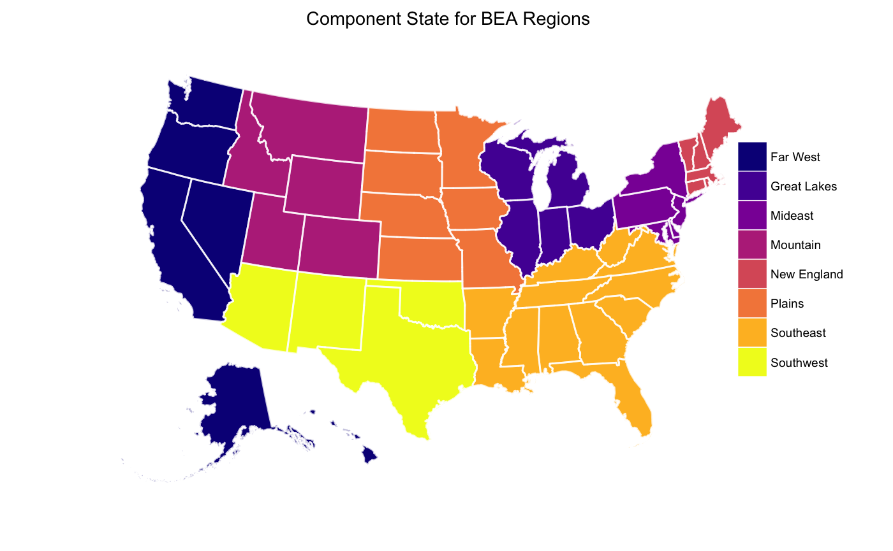
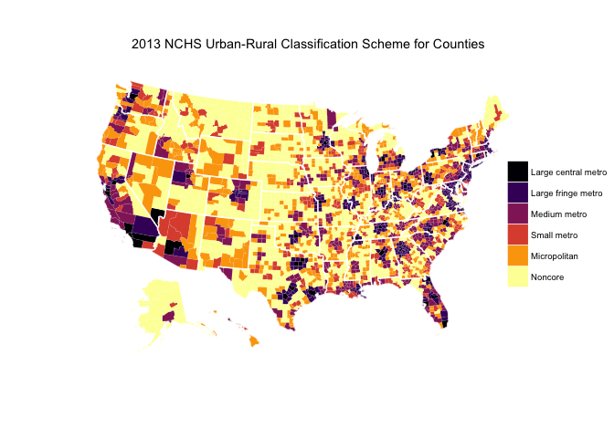
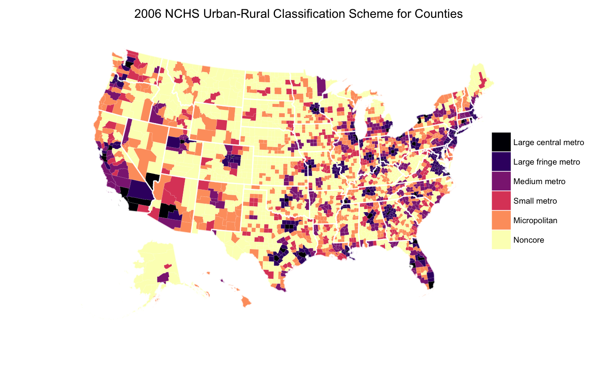
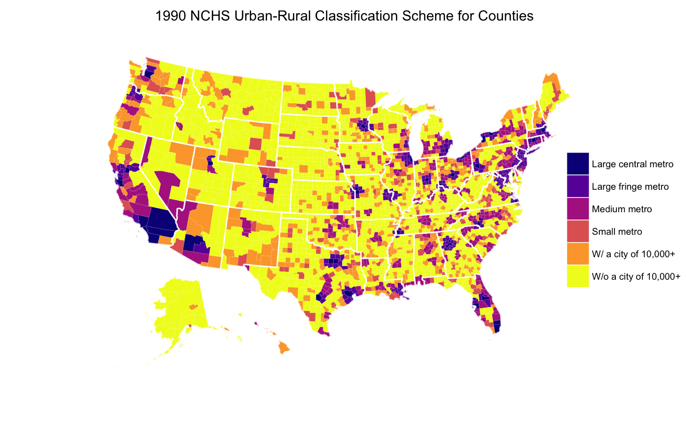

<!-- README.md is generated from README.Rmd. Please edit that file -->

[](https://travis-ci.org/jjchern/fips)
[](https://ci.appveyor.com/project/jjchern/fips)

# About `fips`

The R package `fips` makes it easier to merge geographic identifiers
such as state FIPS, county FIPS, urban-rural codes, and BEA region
codes. The following datasets are available:

  - `fips::fips` and `fips::state`:
      - State-level FIPS codes.
        [(Source)](https://www.census.gov/geo/reference/ansi_statetables.html)
  - `fips::county`:
      - 2010 county-level FIPS codes.
        [(Source)](https://www.census.gov/geo/reference/codes/cou.html)
  - `fips::nchs_urc`:
      - NCHS Urban-Rural Classification Scheme for Counties.
        [(Source)](https://www.cdc.gov/nchs/data_access/urban_rural.htm)
  - `fips::bea_region`:
      - BEA Region codes.
        [(Source)](https://www.bea.gov/regional/docs/regions.cfm)

For a similar implementation in Stata, see [`statastates` by
`wschpero`.](https://github.com/wschpero/statastates)

# Installation

``` r
# install.package("devtools")
devtools::install_github("jjchern/fips@v0.0.2")

# To uninstall the package, use:
# remove.packages("fips")
```

# Usage

## State-level FIPS code

``` r
library(tidyverse)
fips::state
#> # A tibble: 51 x 3
#>    fips  usps  state               
#>    <chr> <chr> <chr>               
#>  1 01    AL    Alabama             
#>  2 02    AK    Alaska              
#>  3 04    AZ    Arizona             
#>  4 05    AR    Arkansas            
#>  5 06    CA    California          
#>  6 08    CO    Colorado            
#>  7 09    CT    Connecticut         
#>  8 10    DE    Delaware            
#>  9 11    DC    District of Columbia
#> 10 12    FL    Florida             
#> # ... with 41 more rows

# fips::fips includes FIPS code for other outlying areas
fips::fips 
#> # A tibble: 57 x 3
#>    fips  usps  state               
#>    <chr> <chr> <chr>               
#>  1 01    AL    Alabama             
#>  2 02    AK    Alaska              
#>  3 04    AZ    Arizona             
#>  4 05    AR    Arkansas            
#>  5 06    CA    California          
#>  6 08    CO    Colorado            
#>  7 09    CT    Connecticut         
#>  8 10    DE    Delaware            
#>  9 11    DC    District of Columbia
#> 10 12    FL    Florida             
#> # ... with 47 more rows
fips::fips %>% tail(10)
#> # A tibble: 10 x 3
#>    fips  usps  state                      
#>    <chr> <chr> <chr>                      
#>  1 53    WA    Washington                 
#>  2 54    WV    West Virginia              
#>  3 55    WI    Wisconsin                  
#>  4 56    WY    Wyoming                    
#>  5 60    AS    American Samoa             
#>  6 66    GU    Guam                       
#>  7 69    MP    Northern Mariana Islands   
#>  8 72    PR    Puerto Rico                
#>  9 74    UM    U.S. Minor Outlying Islands
#> 10 78    VI    U.S. Virgin Islands
```

## 2010 FIPS code for counties

``` r
fips::county
#> # A tibble: 3,235 x 4
#>    usps  state   fips  county         
#>    <chr> <chr>   <chr> <chr>          
#>  1 AL    Alabama 01001 Autauga County 
#>  2 AL    Alabama 01003 Baldwin County 
#>  3 AL    Alabama 01005 Barbour County 
#>  4 AL    Alabama 01007 Bibb County    
#>  5 AL    Alabama 01009 Blount County  
#>  6 AL    Alabama 01011 Bullock County 
#>  7 AL    Alabama 01013 Butler County  
#>  8 AL    Alabama 01015 Calhoun County 
#>  9 AL    Alabama 01017 Chambers County
#> 10 AL    Alabama 01019 Cherokee County
#> # ... with 3,225 more rows
```

## BEA Region codes for states

``` r
fips::bea_region
#> # A tibble: 51 x 7
#>    fips  usps  state  short_region_na… region_code region_name region_abbr
#>    <chr> <chr> <chr>  <chr>                  <int> <chr>       <chr>      
#>  1 09    CT    Conne… New England                1 New Englan… NENG       
#>  2 23    ME    Maine  New England                1 New Englan… NENG       
#>  3 25    MA    Massa… New England                1 New Englan… NENG       
#>  4 33    NH    New H… New England                1 New Englan… NENG       
#>  5 44    RI    Rhode… New England                1 New Englan… NENG       
#>  6 50    VT    Vermo… New England                1 New Englan… NENG       
#>  7 10    DE    Delaw… Mideast                    2 Mideast Re… MEST       
#>  8 11    DC    Distr… Mideast                    2 Mideast Re… MEST       
#>  9 24    MD    Maryl… Mideast                    2 Mideast Re… MEST       
#> 10 34    NJ    New J… Mideast                    2 Mideast Re… MEST       
#> # ... with 41 more rows
```

<!-- -->

## NCHS Urban Rural Codes

``` r
fips::nchs_urc
#> # A tibble: 3,147 x 10
#>    usps  statefip fips  county   code2013  code2006 code1990 cbsatitle    
#>    <chr> <chr>    <chr> <chr>    <dbl+lbl> <dbl+lb> <dbl+lb> <chr>        
#>  1 AL    01       01001 Autauga… 3         3        3        Montgomery, …
#>  2 AL    01       01003 Baldwin… 4         5        3        Daphne-Fairh…
#>  3 AL    01       01005 Barbour… 6         5        5        ""           
#>  4 AL    01       01007 Bibb Co… 2         2        6        Birmingham-H…
#>  5 AL    01       01009 Blount … 2         2        3        Birmingham-H…
#>  6 AL    01       01011 Bullock… 6         6        6        ""           
#>  7 AL    01       01013 Butler … 6         6        6        ""           
#>  8 AL    01       01015 Calhoun… 4         4        4        Anniston-Oxf…
#>  9 AL    01       01017 Chamber… 5         5        6        Valley, AL   
#> 10 AL    01       01019 Cheroke… 6         6        6        ""           
#> # ... with 3,137 more rows, and 2 more variables: cbsapop <dbl>,
#> #   ctypop <dbl>
```

<!-- -->

<!-- -->

<!-- -->
